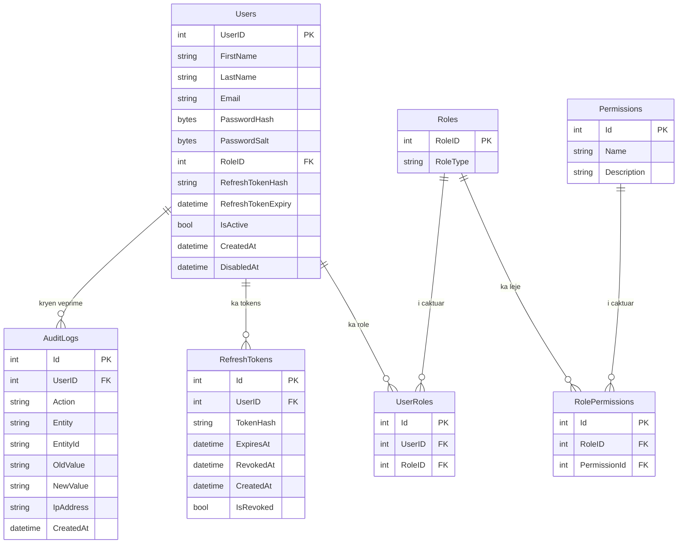
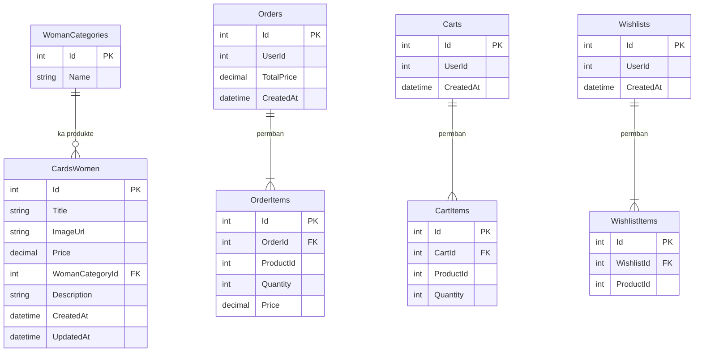
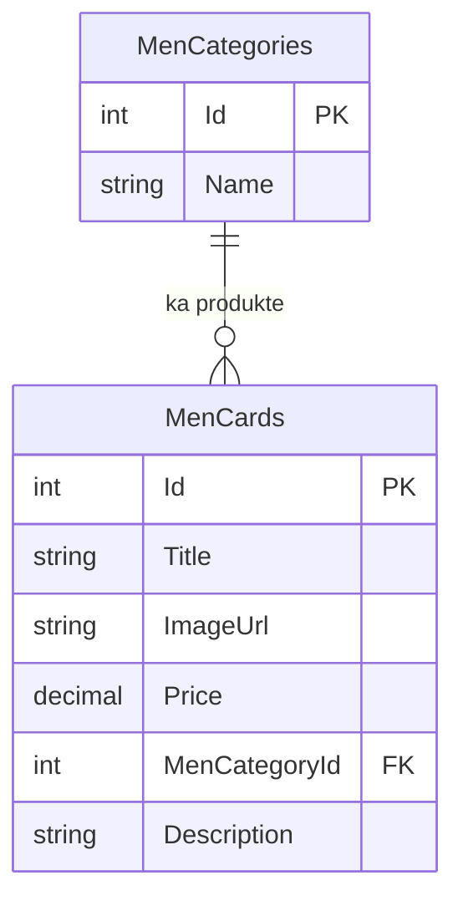
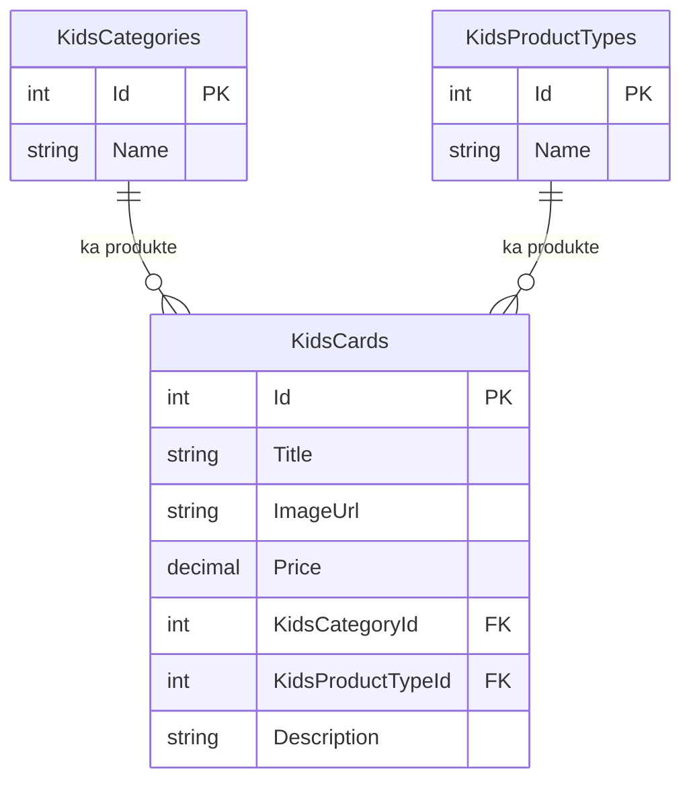
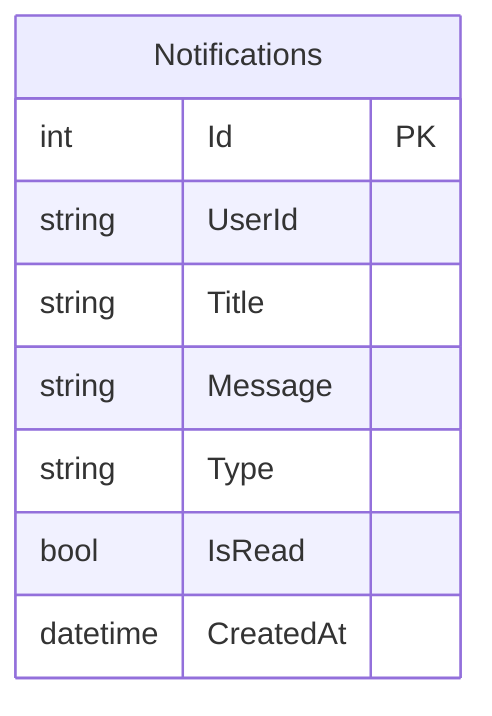
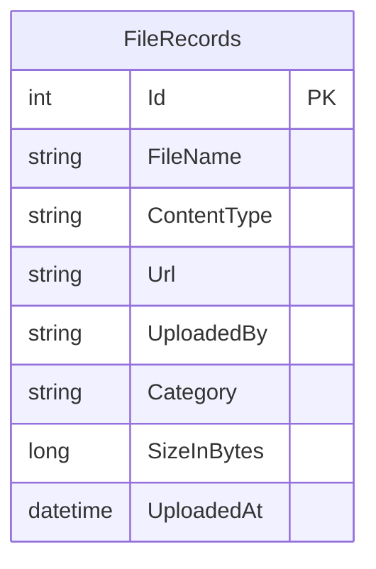
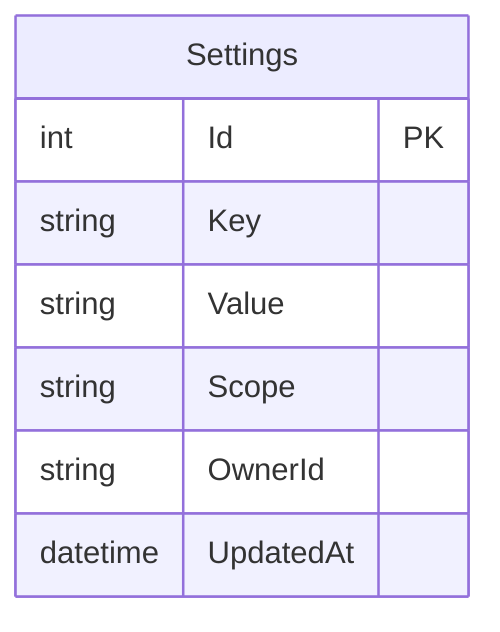
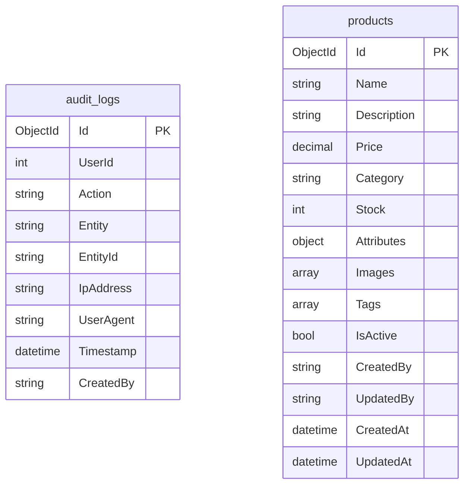

# ERD — Maia Fashion E-Commerce Platform

## Auth Service Database

---

## WomensSection Database

---

## MenSection Database

---

## KidsSection Database

---

## NotificationService Database

---

## FileUploadService Database

---

## SettingsService Database

---

## MongoDB Collections (Maia Service)

---

## Tabela e plotë — 26 tabela

| # | Tabela | Shërbimi | Lloji DB |
|---|--------|----------|----------|
| 1 | Users | Auth | SQL |
| 2 | Roles | Auth | SQL |
| 3 | UserRoles | Auth | SQL |
| 4 | Permissions | Auth | SQL |
| 5 | RolePermissions | Auth | SQL |
| 6 | RefreshTokens | Auth | SQL |
| 7 | AuditLogs | Auth | SQL |
| 8 | CardsWomen | WomensSection | SQL |
| 9 | WomanCategories | WomensSection | SQL |
| 10 | Orders | WomensSection | SQL |
| 11 | OrderItems | WomensSection | SQL |
| 12 | Carts | WomensSection | SQL |
| 13 | CartItems | WomensSection | SQL |
| 14 | Wishlists | WomensSection | SQL |
| 15 | WishlistItems | WomensSection | SQL |
| 16 | MenCards | MenSection | SQL |
| 17 | MenCategories | MenSection | SQL |
| 18 | KidsCards | KidsSection | SQL |
| 19 | KidsCategories | KidsSection | SQL |
| 20 | KidsProductTypes | KidsSection | SQL |
| 21 | Notifications | NotificationService | SQL |
| 22 | FileRecords | FileUploadService | SQL |
| 23 | Settings | SettingsService | SQL |
| 24 | audit_logs | Maia | MongoDB |
| 25 | products | Maia | MongoDB |

**Totali: 25 tabela/koleksione** ✅ *(minimum i kërkuar: 24)*
